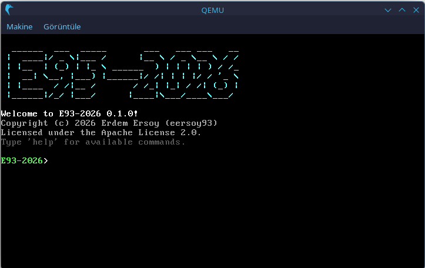

# E93-2026
The new E93! E93-2026!

## Overview

A minimal 32-bit operating system kernel that boots via GRUB2 (Multiboot specification). Written in C and x86 Assembly.



### Features

- **VGA Text Mode** - 80x25 text console with 16 colors
- **VGA Graphics Modes** - Multiple graphics modes supported:
  - Mode 12h: 640x480, 16 colors
  - Mode 13h: 320x200, 256 colors
  - Mode X: 320x240, 256 colors (planar)
  - Mode Y: 320x200, 256 colors (planar)
- **Userspace Programs** - ELF32 executables loaded from ISO9660 filesystem
- **Interactive Shell** - Built-in shell with commands (help, ls, cd, run, etc.)
- **System Calls** - INT 0x80 based syscall interface
- **PC Speaker** - Beep sound support
- **IDE/ISO9660** - Read-only filesystem support

## Prerequisites

- nasm
- qemu (x86 system, pa audio required for beeps)
- GRUB2
- xorriso
- mtools
- GCC (with 32-bit support)
- i686-elf-gcc cross compiler (optional, recommended)

## Building

### Using System GCC (Easier)
```bash
make -f Makefile.gcc iso
```

### Using Cross-Compiler (Recommended)
```bash
make iso
```

## Running

### Boot from ISO (via QEMU)
```bash
make run    # or: make -f Makefile.gcc run
```

## User Programs

User programs are located in `src/user/programs/`. Each `.c` file is compiled into a separate ELF32 executable and included in the ISO.

### Included Programs

| Program | Description |
|---------|-------------|
| `hello` | Simple hello world demo |
| `shell` | Interactive command shell |
| `vga_demo_12h` | VGA 640x480 16-color graphics demo |
| `vga_demo_13h` | VGA 320x200 256-color graphics demo |
| `vga_demo_mode_x` | VGA Mode X 320x240 graphics demo |
| `vga_demo_mode_y` | VGA Mode Y 320x200 planar graphics demo |

### Creating New Programs

See the [SDK documentation](sdk/README.md) for creating user programs.

Quick start:
1. Copy `sdk/template/program.c` to `src/user/programs/myprogram.c`
2. Edit as needed
3. Run `make -f Makefile.gcc iso`
4. In shell: `run myprogram`

## Project Structure

```
E93-2026/
├── src/
│   ├── boot/           # Boot code (boot.asm)
│   ├── kernel/         # Kernel code (kernel.c, idt.c, syscall.c, etc.)
│   ├── drivers/        # Device drivers (vga.c, keyboard.c, ide.c, etc.)
│   ├── lib/            # Kernel libraries
│   ├── include/        # Kernel headers
│   └── user/           # Userspace
│       ├── include/    # User program SDK headers
│       ├── programs/   # User program source files
│       └── user.ld     # User program linker script
├── sdk/                # SDK documentation and templates
├── build/              # Build output (generated)
├── Makefile            # Cross-compiler build
└── Makefile.gcc        # System GCC build
```

## Copyright and License

Copyright (c) 2026 Erdem Ersoy (eersoy93). Licensed under the Apache License 2.0. See the LICENSE file for license text.

E93-2026 written with the help of GitHub Copilot!

**NOTE:** media/pci.ids is licensed under GNU GPLv2. See LICENSE.GPLv2 for the license text.
